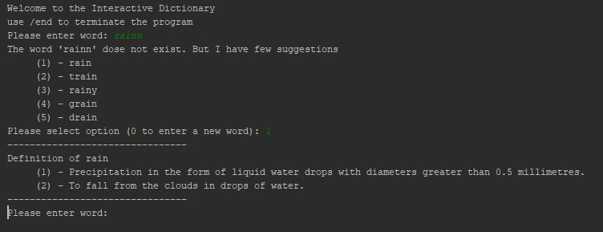
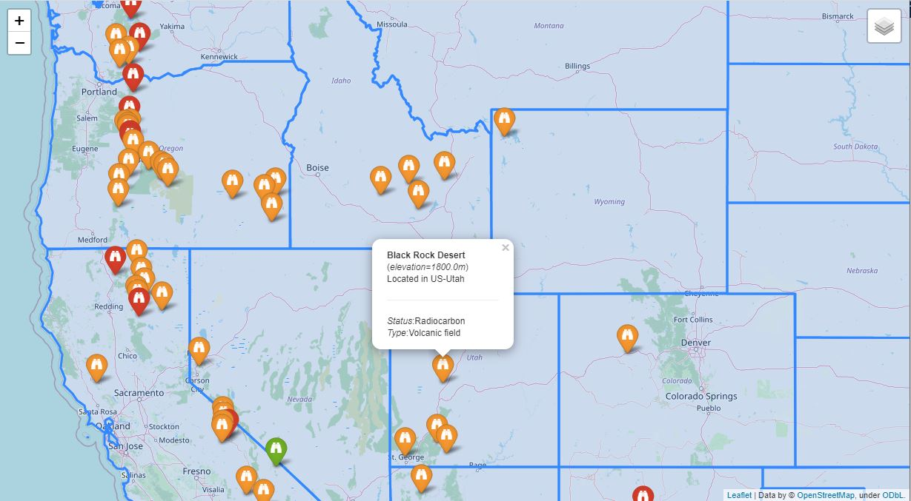
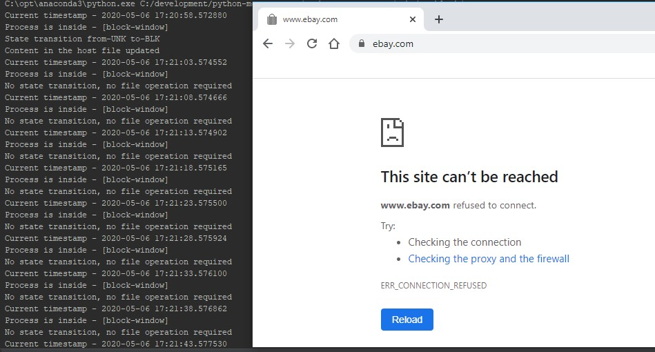
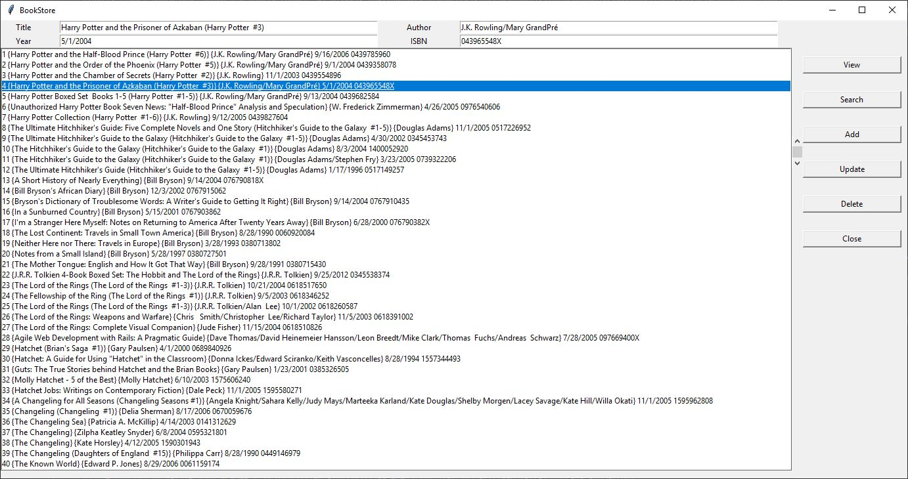

# python-mega-course
Code exercise for the python-mega-course

Name | Description
------------ | -------------
Interactive Dictionary | Simple command line application to get definition of words based on in-memory/database source.
Web Map | Web-map with multiple layers and markers, using Folium
Website Blocker | Simple python script to block (predefine) websites during the predefine time window
Static Web Side | Simple web side with Flask and Jinja templating
Windows GUI | Simple GUI for CRUD operations

### Application 01 - Interactive Dictionary
Simple command line application to get definition of words based on in-memory/database source.

External Modules - [_mysql.connector, difflib, json_]

### Application 02 - WebMap with Folium
Web-map with multiple layers and markers, using Folium (wrapper for [leaflet.js](https://python-visualization.github.io/folium/))

External Modules - [_folium, pandas_]

Source: 
1. https://eric.clst.org/tech/usgeojson/
2. https://www.census.gov/

### Application 03 - Website Blocker 
Simple python script to block (predefine) websites during the predefine time window

### Application 04 - Static Web Side
Simple web side with Flask and Jinja templating

External Modules - [_flask, jinja_]

https://k-sample-app.herokuapp.com/about

### Application 05 - Windows GUI
Simple GUI for CRUD operations
External Modules - [_sqlite3, tkinter_]

